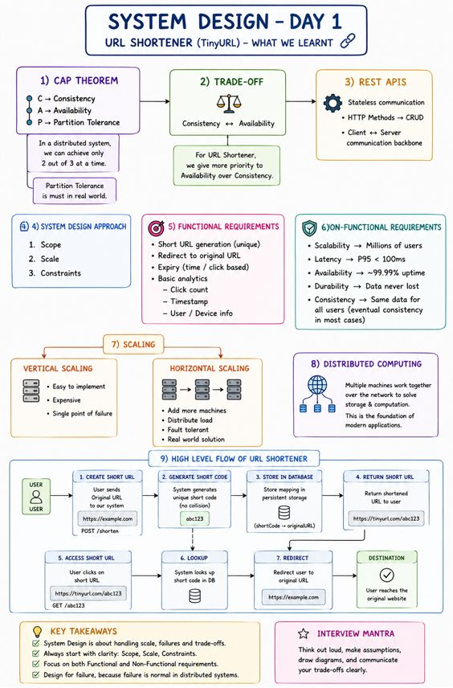

👉𝗔 𝘀𝗶𝗻𝗴𝗹𝗲 𝗰𝗹𝗶𝗰𝗸… 𝗮𝗻𝗱 𝗮 𝗱𝗶𝘀𝘁𝗿𝗶𝗯𝘂𝘁𝗲𝗱 𝘀𝘆𝘀𝘁𝗲𝗺 𝘄𝗮𝗸𝗲𝘀 𝘂𝗽 𝗯𝗲𝗵𝗶𝗻𝗱 𝘁𝗵𝗲 𝘀𝗰𝗲𝗻𝗲𝘀....

Kabhi socha hai — ek chhote se URL ke peeche kitna bada system chhupa hota hai? 🤯
Maine bhi nahi socha tha… jab tak maine System Design ka Day 1 complete nahi kiya.
Aaj humne TinyURL jaisa URL Shortener system design karna start kiya — aur honestly, yeh sirf “link short karna” nahi hai… yeh ek complete distributed system ka foundation hai.
Here’s what I actually understood deeply 👇

🚀 1. CAP Theorem (Reality of Distributed Systems)
C → Consistency
A → Availability
P → Partition Tolerance
👉 Ek time par sirf 2 hi achieve kar sakte hain ( CA or AP or PC )
👉 Real world me Partition Tolerance compulsory hai, kyunki network unreliable hota hai

⚖️ 2. Real Engineering = Trade-offs samajhna
Consistency ↔ Availability
👉 URL Shortener jaise systems me:
Availability ko Consistency se zyada priority dete hain
Kyuki system down nahi hona chahiye, thoda delay acceptable hai

🌐 3. REST APIs (Backbone of Communication)
Stateless communication
HTTP methods → CRUD operations
Client ↔ Server interaction ka base

🧠 4. System Design Approach (Interview Gold)
Koi bhi system design question ho, hamesha clarify karo:
Scope
Scale
Constraints

🔗 5. Functional Requirements (URL Shortener)
Short URL generate karna (unique hona chahiye, no collision)
User ko original URL par redirect karna
Expiry (time-based ya click-based)
Basic analytics:
Click count
Timestamp
User/Device info

⚙️ 6. Non-Functional Requirements (Actual Game Changer)
Scalability → System millions of users handle kar sake
Latency → P95 < 100ms (fast redirection experience)
Availability → ~99.99% uptime (system almost kabhi down na ho)
Durability → Data kabhi lose nahi hona chahiye (persistent storage)
Consistency → Har user ko same data mile

👉 Practical insight:
Strong consistency vs Eventual consistency ka trade-off hota hai
URL Shortener me mostly Eventual Consistency use hoti hai taaki system highly available rahe

📈 7. Scaling finally clear hua
Vertical Scaling → Easy but expensive + single point of failure ❌
Horizontal Scaling → Multiple machines → real-world solution ✅

🌍 8. Distributed Systems ka real matlab
Multiple machines network ke through milkar:
Storage
Computation
solve karte hain → this is what powers modern applications

💡 Big Realization:
System Design sirf code likhne ka naam nahi hai…
👉 It’s about handling failures
👉 It’s about making trade-offs
👉 It’s about designing for scale
👉 It’s about thinking like an engineer, not just a coder

Ab jab bhi koi short link dekhta hoon…
uske peeche pura system imagine hota hai 😄
This is just Day 1… aur already perspective change ho gaya 🚀

## Flowchart

