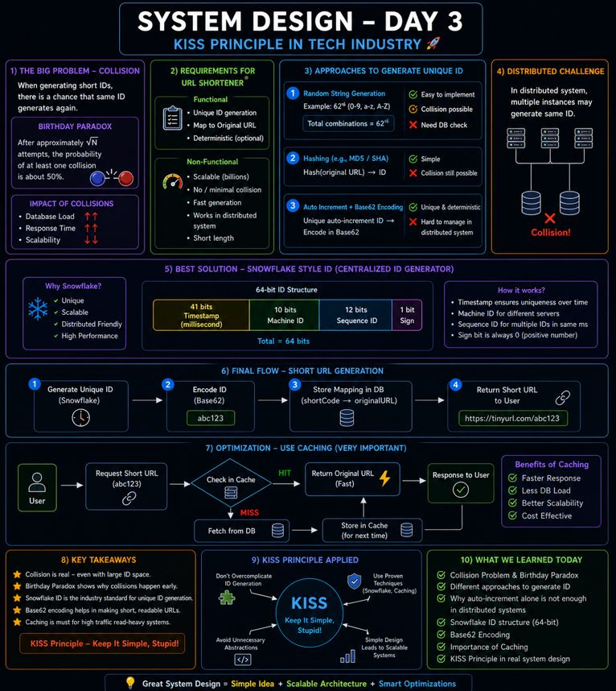

𝐊𝐈𝐒𝐒 𝐏𝐫𝐢𝐧𝐜𝐢𝐩𝐥𝐞 𝐢𝐧 𝐒𝐲𝐬𝐭𝐞𝐦 𝐃𝐞𝐬𝐢𝐠𝐧 (𝐖𝐡𝐲 𝐒𝐢𝐦𝐩𝐥𝐞 𝐒𝐲𝐬𝐭𝐞𝐦𝐬 𝐖𝐢𝐧).......

(Keep It Simple, Scalable)

Day 3 of my 𝐒𝐲𝐬𝐭𝐞𝐦 𝐃𝐞𝐬𝐢𝐠𝐧 𝐣𝐨𝐮𝐫𝐧𝐞𝐲 was all about one critical thing:
👉 𝐇𝐨𝐰 𝐭𝐨 𝐠𝐞𝐧𝐞𝐫𝐚𝐭𝐞 𝐮𝐧𝐢𝐪𝐮𝐞 𝐈𝐃𝐬 𝐟𝐨𝐫 𝐚 𝐔𝐑𝐋 𝐒𝐡𝐨𝐫𝐭𝐞𝐧𝐞𝐫

🧠 𝟏. 𝐂𝐨𝐫𝐞 𝐏𝐫𝐨𝐛𝐥𝐞𝐦 — 𝐂𝐨𝐥𝐥𝐢𝐬𝐢𝐨𝐧
Short URL generate karte waqt same ID repeat ho sakti hai

🎯 𝐁𝐢𝐫𝐭𝐡𝐝𝐚𝐲 𝐏𝐚𝐫𝐚𝐝𝐨𝐱:
👉 ~√N attempts ke baad collision chance ~50%

⚠️ 𝟐. 𝐖𝐡𝐲 𝐂𝐨𝐥𝐥𝐢𝐬𝐢𝐨𝐧𝐬 𝐚𝐫𝐞 𝐃𝐚𝐧𝐠𝐞𝐫𝐨𝐮𝐬

* DB load ↑
* Response time ↑
* Scalability ↓

⚙️ 𝟑. 𝐃𝐢𝐟𝐟𝐞𝐫𝐞𝐧𝐭 𝐀𝐩𝐩𝐫𝐨𝐚𝐜𝐡𝐞𝐬

𝟏. 𝐑𝐚𝐧𝐝𝐨𝐦 𝐒𝐭𝐫𝐢𝐧𝐠𝐬 (𝟔𝟐⁶)
✔ Simple
❌ Collision + DB check

𝟐. 𝐇𝐚𝐬𝐡𝐢𝐧𝐠
✔ Easy
❌ Collision possible

𝟑. 𝐀𝐮𝐭𝐨 𝐈𝐧𝐜𝐫𝐞𝐦𝐞𝐧𝐭 + 𝐁𝐚𝐬𝐞𝟔𝟐
✔ Unique + deterministic
❌ Distributed system me tough

🌍 𝟒. 𝐁𝐞𝐬𝐭 𝐀𝐩𝐩𝐫𝐨𝐚𝐜𝐡 — 𝐒𝐧𝐨𝐰𝐟𝐥𝐚𝐤𝐞 𝐒𝐭𝐲𝐥𝐞 𝐈𝐃
👉 Centralized ID generator

64-bit structure:

* Timestamp
* Machine ID
* Sequence

✔ Unique
✔ Scalable
✔ Distributed-friendly

⚡𝟓. 𝐅𝐢𝐧𝐚𝐥 𝐅𝐥𝐨𝐰
Generate ID → Encode (Base62) → Store in DB → Return short URL

 𝟔. 𝐎𝐩𝐭𝐢𝐦𝐢𝐳𝐚𝐭𝐢𝐨𝐧 (𝐌𝐮𝐬𝐭 𝐇𝐚𝐯𝐞)
👉 Use 𝐂𝐚𝐜𝐡𝐢𝐧𝐠

User → App → Cache → DB (if miss)

✔ Faster
✔ Less DB load

💡 𝐁𝐢𝐠 𝐑𝐞𝐚𝐥𝐢𝐳𝐚𝐭𝐢𝐨𝐧:
System design = simplicity + scale + trade-offs (𝐊𝐈𝐒𝐒 𝐩𝐫𝐢𝐧𝐜𝐢𝐩𝐥𝐞)

Day 3 done ✅
Ab har short URL ke peeche ka logic aur clear ho raha hai 😄

## Flowchart

