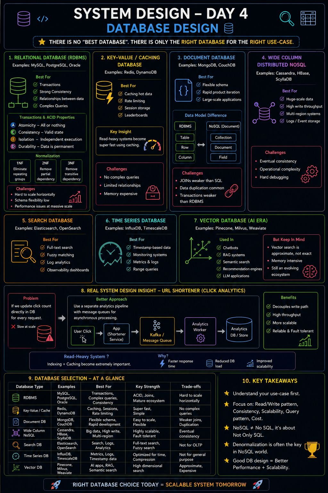

𝐂𝐡𝐨𝐨𝐬𝐢𝐧𝐠 𝐭𝐡𝐞 𝐖𝐫𝐨𝐧𝐠 𝐃𝐚𝐭𝐚𝐛𝐚𝐬𝐞 𝐜𝐚𝐧 𝐛𝐫𝐞𝐚𝐤 𝐲𝐨𝐮𝐫 𝐒𝐲𝐬𝐭𝐞𝐦...

Day 4 of my System Design journey was all about one important realization:

👉 𝐓𝐡𝐞𝐫𝐞 𝐢𝐬 𝐍𝐎 “𝐛𝐞𝐬𝐭 𝐝𝐚𝐭𝐚𝐛𝐚𝐬𝐞”
There is only the 𝐫𝐢𝐠𝐡𝐭 𝐝𝐚𝐭𝐚𝐛𝐚𝐬𝐞 𝐟𝐨𝐫 𝐭𝐡𝐞 𝐫𝐢𝐠𝐡𝐭 𝐮𝐬𝐞-𝐜𝐚𝐬𝐞.

This lecture completely changed how I look at backend systems & scalability.

🧠 𝟏. 𝐑𝐞𝐥𝐚𝐭𝐢𝐨𝐧𝐚𝐥 𝐃𝐚𝐭𝐚𝐛𝐚𝐬𝐞𝐬 (𝐑𝐃𝐁𝐌𝐒)

Best for:
✔ Transactions
✔ Strong consistency
✔ Complex queries

Learned:

• Transactions
• ACID properties
• Normalization (1NF, 2NF, 3NF)
 ⚠️ Hard to scale horizontally

⚡ 𝟐. 𝐊𝐞𝐲-𝐕𝐚𝐥𝐮𝐞 / 𝐂𝐚𝐜𝐡𝐢𝐧𝐠 𝐃𝐚𝐭𝐚𝐛𝐚𝐬𝐞𝐬
Examples: Redis, DynamoDB

Best for:
✔ Caching 
✔ Rate limiting
✔ Sessions

👉 Read-heavy systems become super fast using caching

⚠️ No complex queries

📄 𝟑. 𝐃𝐨𝐜𝐮𝐦𝐞𝐧𝐭 𝐃B (MongoDB)

Best for:
✔ Flexible schema
✔ Rapid product iteration
✔ Large-scale apps

RDBMS → Tables 
NoSQL → Documents

 ⚠️JOINs weaker than SQL

🌍 𝟒. 𝐖𝐢𝐝𝐞 𝐂𝐨𝐥𝐮𝐦𝐧 𝐍𝐨𝐒𝐐𝐋
Used for:
✔ Huge-scale data
✔ High write throughput
✔ Multi-region systems

⚠️ Eventual consistency & Operational complexity

🔎 𝟓. 𝐒𝐞𝐚𝐫𝐜𝐡 𝐃B (Elasticsearch) 

✔ Full-text search
✔ Fuzzy matching
✔ Log analytics

⏱️ 𝟔. 𝐓𝐢𝐦𝐞 𝐒𝐞𝐫𝐢𝐞𝐬 𝐃B

Used for:
✔ Timestamp-based data
✔ Monitoring
✔ Metrics

🤖 𝟕. 𝐕𝐞𝐜𝐭𝐨𝐫 𝐃B (𝐀𝐈 𝐄𝐫𝐚)
Example: Pinecone

Used in:
✔ Chatbots
✔ RAG systems
✔ Semantic search

But learned that:
⚠️ Vector search is approximate, not exact
⚠️ Memory intensive
⚠️ Still an evolving ecosystem

⚡ 𝟖. 𝐑𝐞𝐚𝐥 𝐒𝐲𝐬𝐭𝐞𝐦 𝐃𝐞𝐬𝐢𝐠𝐧 𝐈𝐧𝐬𝐢𝐠𝐡𝐭 (𝐔𝐑𝐋 𝐒𝐡𝐨𝐫𝐭𝐞𝐧𝐞𝐫)

❌ Direct DB updates = slow at scale

✅ Better approach:
Use 𝐊𝐚𝐟𝐤𝐚/𝐦𝐞𝐬𝐬𝐚𝐠𝐞 𝐪𝐮𝐞𝐮𝐞𝐬 for asynchronous processing.

💡 𝐁𝐢𝐠 𝐓𝐚𝐤𝐞𝐚𝐰𝐚𝐲:
Good system design is not about using the most popular database.

👉 It’s about understanding:

 Read vs Write traffic
 Scalability needs
 Consistency requirements
 Query patterns
 Cost & performance trade-offs

👉 It’s about understanding:

 Read vs Write traffic
 Scalability needs
 Consistency requirements
 Query patterns
 Cost & performance trade-offs

Day 4 done ✅
Now I’m starting to understand why backend architecture decisions are so critical in real-world systems 

## Flowchart

