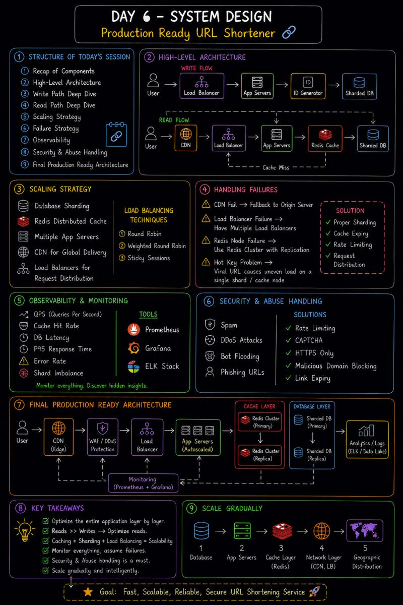

𝗗𝗮𝘆 𝟲 𝗼𝗳 𝗺𝘆 𝗦𝘆𝘀𝘁𝗲𝗺 𝗗𝗲𝘀𝗶𝗴𝗻 𝗷𝗼𝘂𝗿𝗻𝗲𝘆 — 𝗕𝘂𝗶𝗹𝗱𝗶𝗻𝗴 𝗮 𝗣𝗿𝗼𝗱𝘂𝗰𝘁𝗶𝗼𝗻-𝗥𝗲𝗮𝗱𝘆 𝗨𝗥𝗟 𝗦𝗵𝗼𝗿𝘁𝗲𝗻𝗲𝗿

This lecture connected everything I learned in previous days into one complete scalable architecture.
For the first time, I could actually visualize how real-world backend systems are designed layer by layer.

👉 Main focus of Day 6:
• High-level architecture
• Read & write flow
• Scaling strategies
• Failure handling
• Observability
• Security & abuse prevention
• Final production-ready architecture

🧠 𝟭. 𝗨𝗻𝗱𝗲𝗿𝘀𝘁𝗮𝗻𝗱𝗶𝗻𝗴 𝘁𝗵𝗲 𝗖𝗼𝗺𝗽𝗹𝗲𝘁𝗲 𝗥𝗲𝗾𝘂𝗲𝘀𝘁 𝗙𝗹𝗼𝘄

### ✍️ Write Path

User → Load Balancer → App Server → ID Generator → Sharded Database

### 📖 Read Path

User → CDN → Load Balancer → App Servers → Redis Cache → Database

Big realization:
👉 Real systems optimize reads aggressively because reads are usually much higher than writes.

⚡𝟮. 𝗦𝗰𝗮𝗹𝗶𝗻𝗴 𝘁𝗵𝗲 𝗦𝘆𝘀𝘁𝗲𝗺

Learned how production systems handle massive traffic using:

✔ Database Sharding
✔ Redis Distributed Cache
✔ Multiple App Servers
✔ CDN for global delivery
✔ Load Balancers for request distribution

Also learned different load balancing strategies:
• Round Robin
• Weighted Round Robin
• Sticky Sessions

🔥 𝟯. 𝗛𝗮𝗻𝗱𝗹𝗶𝗻𝗴 𝗙𝗮𝗶𝗹𝘂𝗿𝗲𝘀 𝗶𝗻 𝗗𝗶𝘀𝘁𝗿𝗶𝗯𝘂𝘁𝗲𝗱 𝗦𝘆𝘀𝘁𝗲𝗺𝘀
A scalable system is useless if it breaks during failures.

Learned about:

⚠️ CDN failures
⚠️ Load balancer as single point of failure
⚠️ Redis node failures
⚠️ Hot key problem (viral URLs causing uneven load)

One interesting insight:
👉 Viral content can overload a single shard/cache node if traffic is not distributed properly.

📊 𝟰. 𝗢𝗯𝘀𝗲𝗿𝘃𝗮𝗯𝗶𝗹𝗶𝘁𝘆 & 𝗠𝗼𝗻𝗶𝘁𝗼𝗿𝗶𝗻𝗴

Hidden insights about the system are extremely important.

Metrics to track:
✔ QPS
✔ Cache hit rate
✔ DB latency
✔ P95 response time
✔ Error rates
✔ Shard imbalance

Tools learned:
• Prometheus
• Grafana
• ELK Stack

🛡️ 𝟱. 𝗦𝗲𝗰𝘂𝗿𝗶𝘁𝘆 & 𝗔𝗯𝘂𝘀𝗲 𝗛𝗮𝗻𝗱𝗹𝗶𝗻𝗴

Real systems must also defend against attacks and misuse.

Learned solutions for:
✔ Spam
✔ DDoS attacks
✔ Bot flooding
✔ Phishing URLs

Techniques used:
• Rate limiting
• CAPTCHA
• HTTPS only
• Malicious domain blocking
• Link expiry

🏗️ 𝟲. 𝗙𝗶𝗻𝗮𝗹 𝗔𝗿𝗰𝗵𝗶𝘁𝗲𝗰𝘁𝘂𝗿𝗲 𝗟𝗲𝗮𝗿𝗻𝗶𝗻𝗴

The biggest takeaway from Day 6:
👉 System Design is all about optimizing the entire application layer by layer.

Scale gradually:
1️⃣ Database
2️⃣ Application servers
3️⃣ Cache layer
4️⃣ Network layer
5️⃣ Geographic distribution using CDN

💡 𝗕𝗶𝗴 𝗧𝗮𝗸𝗲𝗮𝘄𝗮𝘆:
A production-ready system is not built using a single technology.
It is built by combining caching, databases, load balancing, monitoring, security, and scalability strategies together. 
Day 6 done ✅

## Flowchart

