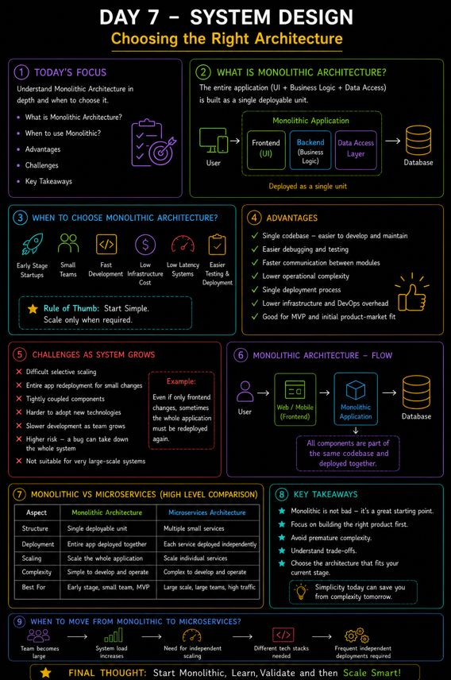

𝗗𝗮𝘆 𝟳 𝗼𝗳 𝗺𝘆 𝗦𝘆𝘀𝘁𝗲𝗺 𝗗𝗲𝘀𝗶𝗴𝗻 𝗷𝗼𝘂𝗿𝗻𝗲𝘆 — 𝗖𝗵𝗼𝗼𝘀𝗶𝗻𝗴 𝘁𝗵𝗲 𝗥𝗶𝗴𝗵𝘁 𝗔𝗿𝗰𝗵𝗶𝘁𝗲𝗰𝘁𝘂𝗿𝗲

Today’s lecture was less about tools and more about 𝗲𝗻𝗴𝗶𝗻𝗲𝗲𝗿𝗶𝗻𝗴 𝗱𝗲𝗰𝗶𝘀𝗶𝗼𝗻𝘀.
One thing became very clear:

👉 A good architecture is not the most complex one.
👉 It’s the one that fits your product stage and scaling needs.

🧠 𝗠𝗮𝗶𝗻 𝗟𝗲𝗮𝗿𝗻𝗶𝗻𝗴 — 𝗠𝗼𝗻𝗼𝗹𝗶𝘁𝗵𝗶𝗰 𝗔𝗿𝗰𝗵𝗶𝘁𝗲𝗰𝘁𝘂𝗿𝗲

A Monolithic system means:

Frontend + Backend + Database
➡ All combined into one large application.

At first, I thought monolithic systems were “outdated”…
but today I learned why many startups actually begin with them.

⚡ 𝗪𝗵𝗲𝗻 𝗠𝗼𝗻𝗼𝗹𝗶𝘁𝗵𝗶𝗰 𝗔𝗿𝗰𝗵𝗶𝘁𝗲𝗰𝘁𝘂𝗿𝗲 𝗪𝗼𝗿𝗸𝘀 𝗕𝗲𝘀𝘁

✔ Early-stage startups
✔ Small teams
✔ Fast development
✔ Low infrastructure cost
✔ Low latency systems
✔ Easier testing & deployment

Big insight:
👉 If you are building a new product and don’t yet know the scale, starting simple is often the smartest choice.

🔥 𝗔𝗱𝘃𝗮𝗻𝘁𝗮𝗴𝗲𝘀 𝗼𝗳 𝗠𝗼𝗻𝗼𝗹𝗶𝘁𝗵𝗶𝗰 𝗦𝘆𝘀𝘁𝗲𝗺𝘀

• Single codebase
• Easier debugging
• Faster communication between modules
• Lower operational complexity
• More affordable infrastructure

This explains why many MVPs are initially built as monoliths.

⚠️ 𝗖𝗵𝗮𝗹𝗹𝗲𝗻𝗴𝗲𝘀 𝗼𝗳 𝗠𝗼𝗻𝗼𝗹𝗶𝘁𝗵𝗶𝗰 𝗔𝗿𝗰𝗵𝗶𝘁𝗲𝗰𝘁𝘂𝗿𝗲

As the system grows, problems also grow.

Learned about issues like:

❌ Difficult selective scaling
❌ Entire app redeployment even for small changes
❌ Teams become tightly coupled
❌ Low agility between frontend & backend teams
❌ Technology flexibility becomes limited

One interesting insight:
👉 Even if only frontend changes, sometimes the whole application must be redeployed again.

📈 𝗠𝗼𝘀𝘁 𝗜𝗺𝗽𝗼𝗿𝘁𝗮𝗻𝘁 𝗧𝗮𝗸𝗲𝗮𝘄𝗮𝘆

System Design is all about trade-offs.

Microservices are powerful…
but they are NOT always the correct starting point.

Sometimes:
👉 Simplicity > Complexity
👉 Fast iteration > Premature scaling

💡 𝗕𝗶𝗴 𝗧𝗮𝗸𝗲𝗮𝘄𝗮𝘆:

Start simple.
Scale only when the product truly demands it. 🚀

Day 7 done ✅

## Flowchart

