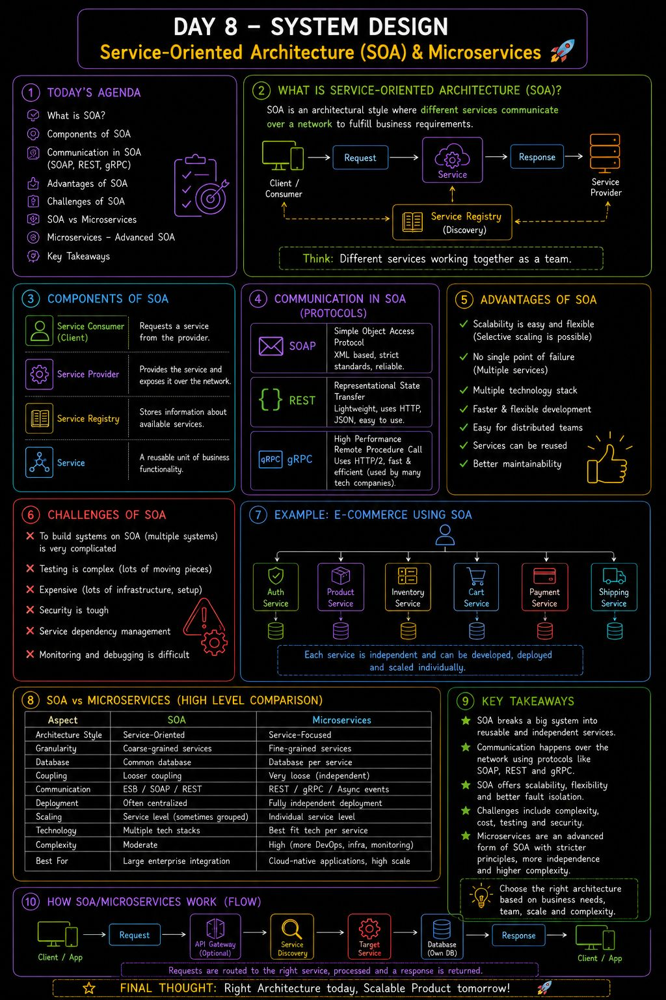

𝗗𝗮𝘆 𝟴 𝗼𝗳 𝗺𝘆 𝗦𝘆𝘀𝘁𝗲𝗺 𝗗𝗲𝘀𝗶𝗴𝗻 𝗝𝗼𝘂𝗿𝗻𝗲𝘆 — 𝗦𝗲𝗿𝘃𝗶𝗰𝗲-𝗢𝗿𝗶𝗲𝗻𝘁𝗲𝗱 𝗔𝗿𝗰𝗵𝗶𝘁𝗲𝗰𝘁𝘂𝗿𝗲 (𝗦𝗢𝗔) & 𝗠𝗶𝗰𝗿𝗼𝘀𝗲𝗿𝘃𝗶𝗰𝗲𝘀
Today I learned one of the biggest architectural shifts in modern backend development:
👉 Instead of building one giant application, break it into multiple independent services that communicate over the network.
This is the foundation of Service-Oriented Architecture (SOA).
🧠 𝗪𝗵𝗮𝘁 𝗜 𝗹𝗲𝗮𝗿𝗻𝗲𝗱
✅ Components of SOA
Service Provider
Service Consumer
Service Registry
Communication using 𝗦𝗢𝗔𝗣, 𝗥𝗘𝗦𝗧 & 𝗴𝗥𝗣𝗖
The idea is simple:
Different services handle different responsibilities while communicating through APIs.
For example, an e-commerce platform can have separate services for:
Cart
Checkout
Inventory
Payment
Authentication
Shipping
Each service can even be built using the technology best suited for it.
⚡ 𝗔𝗱𝘃𝗮𝗻𝘁𝗮𝗴𝗲𝘀 𝗼𝗳 𝗦𝗢𝗔
✔ Independent service development
✔ Easier scaling of individual services
✔ Better fault isolation
✔ Multiple technology stacks can coexist
✔ Better collaboration across teams
 ⚠️ 𝗖𝗵𝗮𝗹𝗹𝗲𝗻𝗴𝗲𝘀
Higher infrastructure complexity
Difficult testing across multiple services
Increased operational cost
Security becomes more challenging
🔥 𝗦𝗢𝗔 𝘃𝘀 𝗠𝗶𝗰𝗿𝗼𝘀𝗲𝗿𝘃𝗶𝗰𝗲𝘀
One interesting insight today was that Microservices are an evolution of SOA with stricter design principles.
While SOA often shares a common database, Microservices usually follow:
One service → One database
Loose coupling
Independent deployment
Independent scaling
This makes Microservices more flexible, but also significantly more complex.
💡 Big Takeaway:
There isn't a "best" architecture.
Monolith, SOA, and Microservices all solve different problems.
Choosing the right architecture depends on:
Team size
Product maturity
Scale requirements
Operational complexity
Business needs
Day 8 done ✅

## Flowchart

