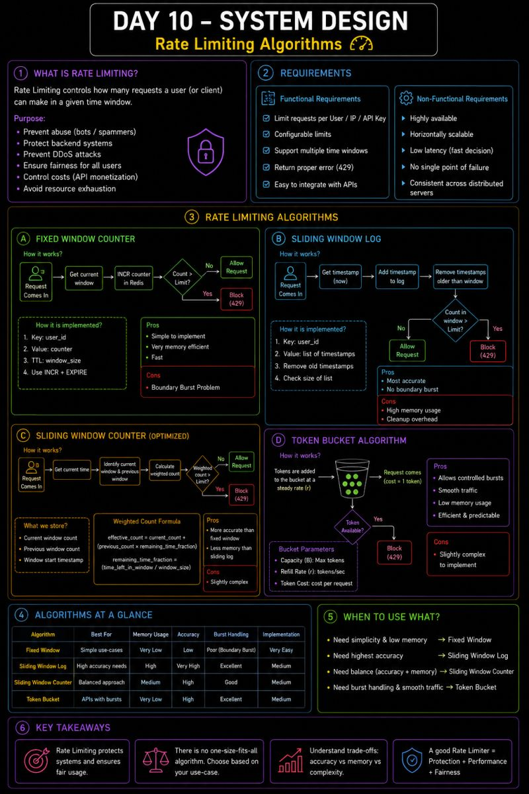

 𝗗𝗮𝘆 𝟭𝟬 𝗼𝗳 𝗠𝘆 𝗦𝘆𝘀𝘁𝗲𝗺 𝗗𝗲𝘀𝗶𝗴𝗻 𝗟𝗲𝗮𝗿𝗻𝗶𝗻𝗴 𝗝𝗼𝘂𝗿𝗻𝗲𝘆

Today was all about Rate Limiting—one of the most practical concepts used in production systems to protect APIs and ensure fair resource usage.

What started with a simple question:

"𝗛𝗼𝘄 𝗱𝗼 𝗽𝗹𝗮𝘁𝗳𝗼𝗿𝗺𝘀 𝗹𝗶𝗸𝗲 𝗖𝗵𝗮𝘁𝗚𝗣𝗧, 𝗚𝗶𝘁𝗛𝘂𝗯, 𝗼𝗿 𝗦𝘁𝗿𝗶𝗽𝗲 𝗹𝗶𝗺𝗶𝘁 𝗔𝗣𝗜 𝗿𝗲𝗾𝘂𝗲𝘀𝘁𝘀?"

 turned into a deep dive into different rate-limiting algorithms and their trade-offs.

📚 𝗪𝗵𝗮𝘁 𝗜 𝗹𝗲𝗮𝗿𝗻𝗲𝗱 𝘁𝗼𝗱𝗮𝘆

🔹 𝗙𝗶𝘅𝗲𝗱 𝗪𝗶𝗻𝗱𝗼𝘄 𝗖𝗼𝘂𝗻𝘁𝗲𝗿

Simple implementation using Redis (INCR + EXPIRE)

Very memory efficient

Easy to implement

⚠️ Suffers from the Boundary Burst Problem (users can exceed limits around window boundaries)

🔹 𝗦𝗹𝗶𝗱𝗶𝗻𝗴 𝗪𝗶𝗻𝗱𝗼𝘄 𝗟𝗼𝗴

Stores timestamps of every request

Eliminates the boundary burst issue

Extremely accurate

Higher memory usage and cleanup cost

🔹 𝗦𝗹𝗶𝗱𝗶𝗻𝗴 𝗪𝗶𝗻𝗱𝗼𝘄 𝗖𝗼𝘂𝗻𝘁𝗲𝗿 (𝗢𝗽𝘁𝗶𝗺𝗶𝘇𝗲𝗱)

Stores only:

Current window count

Previous window count

Calculates a weighted request count

Great balance between memory usage and accuracy

A production-friendly improvement over Sliding Window Log

🔹 𝗧𝗼𝗸𝗲𝗻 𝗕𝘂𝗰𝗸𝗲𝘁 𝗔𝗹𝗴𝗼𝗿𝗶𝘁𝗵𝗺

One of the most widely used production algorithms.

Key takeaways:

 ✅ Allows controlled bursts

 ✅ Smooths incoming traffic

 ✅ Very low memory usage

 ✅ Predictable and efficient

💡 Biggest takeaway

𝗧𝗵𝗲𝗿𝗲 𝗶𝘀 𝗻𝗼 𝘂𝗻𝗶𝘃𝗲𝗿𝘀𝗮𝗹𝗹𝘆 "𝗯𝗲𝘀𝘁" 𝗿𝗮𝘁𝗲 𝗹𝗶𝗺𝗶𝘁𝗲𝗿.

The right choice depends on your product's requirements:

Simplicity

Memory constraints

Accuracy

Traffic patterns

Burst tolerance

System Design is all about understanding these trade-offs rather than memorizing algorithms.

## Flowchart

